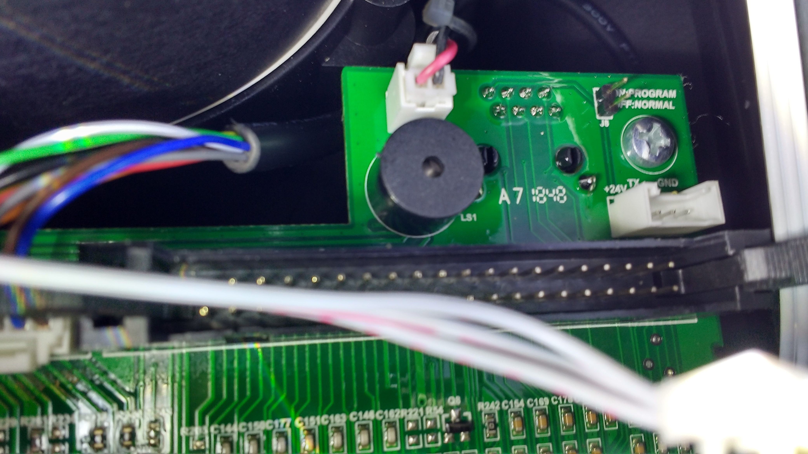

# Gardenfeelings R800 Easy

# Inside
Look inside the Robot to get Access to a programming interface:

* Switch off the central robot power switch under the back side grip.
* Turn the big black button to set the mower cut height to 30-40 mm. This makes the screws of the battery cover at the bottom side accessible. 
* Put a small head screw driver carefully into the small top openings of the black cut height button. Carefully lever up the cover. Take the cover up. Loose the screw using a 10mm allen key. Take of the buttton.
* Turn the robot upside down on soft ground. Loose the 4 screws of the black small cover at the front of the robot. Take of the cover. Look to the white currency connector. Notice the wire colors to replug it in the same way later on. Unplug it. Unplug the smaller white plug. Now the two black cables from the inner part of the robot are loosen.
* ATTENTION: behold the 3 mower knifes. Do not touch the sharp edges. To be secure you might remove them.
* Lose the 4 battery box cover screws and take of the cover. Take out the Battery. Notice the RJ45 co
* Lose the 4 large screws which hold the robot cover.
* Take the robot out of its cover and turn it top up.
* Lose the 4 screws of the display panel. Be carefull in the next steps! Lift of the back edge of the panel just a bit. Unplug the ribon cable connector by using the levers at the sides. Lift up the back edge of the panel a bit more and unplug the white connector. Take of the panel.
* At the right front edge of the circuit board there is an open jumper. "on = programm mode, off = normal mode"

